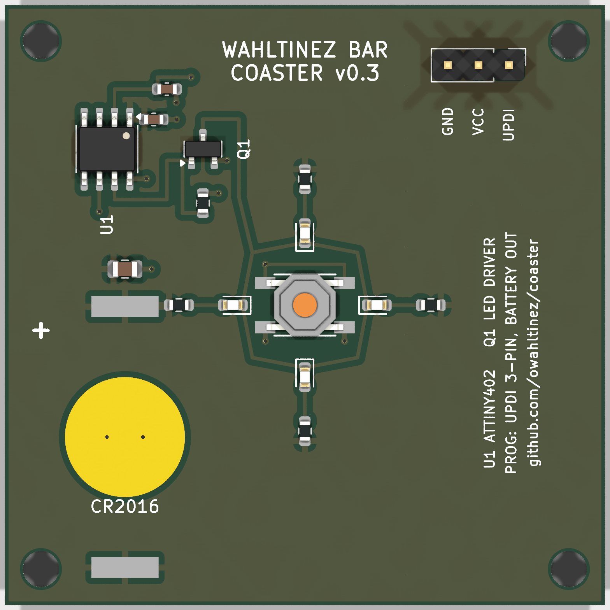

# Coaster

Very simple battery-operated device. When you push a button, the light turns on for a few seconds
and then it turns off. It is designed to be used as a coaster such that, when gently pushing a glass
down on the device, the light activates making the contents of the glass glow.

Pressing down on the coaster triggers a ~8 second light show: the LEDs ramp up to full
brightness, "breathe" gently five times, and fade back to black. Between shows the device
sleeps at ~1 µA — there is no on/off switch and none is needed.

## Repository layout

- `firmware/` — AVR C firmware and its build/flash Makefile.
- `pcb/` — v0.3 board design (KiCad, generated from python scripts) and footprints.
- `enclosure/` — 3D-printed shell (FreeCAD source + STEP/STL export).
- `tools/` — pinned toolchain containers (KiCad for the board, avr-gcc for the firmware).

All subdirectories share the same verbs, and the top-level Makefile forwards to each:
`make build` (firmware hex + board + enclosure exports), `make test` (flash-fit check +
board DRC + enclosure solidity check), `make clean`. Domain-specific verbs forward to the
relevant subdirectory: `make flash` / `make fuses` (firmware programming),
`make review` (board render / PDF / STEP), `make fab` (JLCPCB order bundle). The
firmware and PCB verbs run inside pinned containers — `make image` builds them once
(see Software); flashing stays on the host.

## How it works

The button connects an MCU pin (with its internal pull-up) to ground. Pressing it fires a
falling-edge interrupt on one of the ATtiny202's fully-asynchronous pins, which wakes the
chip from power-down sleep with the main clock stopped — a press costs effectively no
charge. The firmware debounces the edge, plays the show over hardware PWM through a
MOSFET driving four series-resistored LEDs, and goes back to sleep.

Two details carry hard-won lessons from v0.2:

- The show also plays once when the battery is inserted (a power-on reset doubles as a
  built-in self test), but *only* on a power-on reset: a brown-out reset means a dying
  cell sagged below 1.8V mid-show, and playing again would loop the cell to death — so a
  brown-out goes straight back to sleep and the coaster simply dims gracefully as the
  battery wears out.
- Wake edges that turn out not to be presses (e.g. contact bounce while lifting a glass
  off a held-down button) are filtered by a 20ms debounce check, so the show plays on
  deliberate presses only.

## Hardware



The v0.3 design (KiCad) lives in `pcb/`:

- `pcb/design.py` is the circuit as data — parts, placements, and the netlist defined
  once. This is the file to read or edit; it is the source of truth.
- `pcb/DESIGN.md` is the design specification: pin map, BOM with part rationale,
  ordering plan, and the validation checklists.
- `pcb/generate.py` turns `design.py` into `coaster.kicad_pcb` (committed for
  convenience). `make build` regenerates the board and validates connectivity; `make
  test` runs DRC; `make review` produces a board render, a 1:1 printable PDF, and a STEP
  model for CAD fit checks.
- `pcb/coaster.pretty/` — project footprints with pad geometry extracted from the
  manufactured v0.2 board (battery holder, tactile switch).

There is no schematic: JLCPCB takes Gerbers + BOM + CPL (not a schematic), the board is
built and checked directly against `design.py`, and `design.py` itself documents the
circuit — so a derived schematic would add nothing.

The previous revision (v0.2: ATtiny13A, EasyEDA, CR2032) is archived at release
[v0.2.1](https://github.com/owahltinez/coaster/releases/tag/v0.2.1), including its
firmware, schematic renderings, and 3D printing assets.

### Production

All SMD parts are LCSC-stocked, so the board can be fabricated and assembled through
JLCPCB — the only hand-assembly per unit is dropping a CR2016 into the holder. `make
fab` writes the three JLCPCB uploads (Gerbers zip + BOM + CPL) to `pcb/dist/`; order
with **white soldermask** (the board face is the reflector behind the LEDs). The full
step-by-step — orientation checks, stock confirmation, post-assembly flashing — is the
ordering plan in [pcb/DESIGN.md](pcb/DESIGN.md).

Rough per-unit estimates as of June 2026 (USD, assembled and shipped; ~A$1.55/US$):

| Per unit               | Qty 30  | Qty 100 | Qty 1k  | Qty 10k |
|------------------------|---------|---------|---------|---------|
| Parts                  | $0.74   | $0.70   | ~$0.60  | ~$0.47  |
| Feeder/setup/stencil   | $0.72   | $0.30   | ~$0.04  | ~$0     |
| PCB + assembly         | $0.47   | $0.40   | ~$0.30  | ~$0.20  |
| Board shipping         | $0.20   | $0.35   | ~$0.10  | ~$0.05  |
| CR2016 (name-brand)    | $0.65   | $0.35   | ~$0.20  | ~$0.12  |
| Enclosure              | $0.60 (FDM) | $0.60 (FDM) | ~$1.00 (print farm)\* | ~$0.30 (molded)\* |
| **Finished coaster**   | **~$3.40** | **~$2.70** | **~$2.25** | **~$1.10** |

\*The 1k column keeps FDM but prices it honestly: ~2,500 printer-hours, which a small
farm of four budget printers clears in under a month — filament plus printer
amortization lands near $1/unit, with no tooling commitment and the printers kept at
the end. The 10k column switches to injection molding (aluminum tooling, amortized);
that is also the column where a further redesign pays — shrinking the PCB from the
structural 50×50mm to a ~25mm puck and letting the molded shell carry the mechanical
roles would cut the PCB line by ~$0.10 more. If 1k is a milestone toward 10k rather
than the destination, rapid aluminum tooling (~$1–1.5k) prices similarly at 1k and
carries forward.

The electronics architecture is the same in every column — the MCU ($0.30–0.43) is the
cheapest line that matters, and it is the entire personality of the product. Prices
drift; get a real quote from the [JLCPCB quote tool](https://jlcpcb.com/quote) and
confirm ATtiny202 stock at order time (the ATtiny402 is a firmware-compatible drop-in
substitute).

## Software

The firmware and board builds run in **pinned containers** (`tools/`), so the host
needs neither a KiCad nor an AVR toolchain — only a container engine. Pinning is what
keeps the artifacts reproducible: the committed board is KiCad-10 format and host KiCad
drifts (Debian ships v9, which can't even open a v10 board), and the ATtiny202 firmware
needs avr-gcc ≥ 12 (the README used to hand-source `avr-gcc@14` from the
[osx-cross/avr](https://github.com/osx-cross/homebrew-avr) tap on macOS). Build the
images once, then the verbs route through them automatically:

```bash
make image               # build both images: coaster-fw + coaster-pcb (re-run after editing a Containerfile)
make build               # firmware hex + board + enclosure, each in its toolchain
make fab                 # regenerate the board + emit the JLCPCB bundle, in the container
```

The enclosure builds the same way, in a pinned FreeCAD 1.1.1 container (`make image`
builds it too) — so the host needs no FreeCAD either, and the old macOS `freecadcmd`
symlink dance is gone.

`docker` here is a [Podman](https://podman.io) alias (`podman-docker`); override
`CONTAINER_ENGINE` to use another runtime. Rootless Podman maps container-root to your
UID (the Makefile passes `--user 0`), so generated files come back owned by you. The
rule is **produce artifacts in a container, touch hardware on the host** — so flashing
(`make flash` / `make fuses`, which need a USB-serial adapter) stays on the host and
needs `avrdude` (≥ 7, for `serialupdi`) installed there; see Flashing below.

The **enclosure** build still runs on the host via FreeCAD (`freecadcmd`); on macOS the
app bundle doesn't expose its CLI, so symlink it once:

```bash
ln -s /Applications/FreeCAD.app/Contents/Resources/bin/freecadcmd /opt/homebrew/bin/freecadcmd
```

### Flashing

No dedicated programmer needed: UPDI works over any USB-serial adapter with a single
~1kΩ resistor bridging the adapter's TX to RX, and RX wired to the board's UPDI pad
(plus VDD and GND — the J1 pads are labeled on the silkscreen).

```bash
make flash   # writes main.hex over serialupdi
make fuses   # once per chip: brown-out detector at 1.8V, sampled in sleep
```

The fuses matter: the factory default leaves the BOD disabled, which allows undefined
behavior when the battery sags, and the firmware's brown-out logic depends on it.

Gotchas:

- **Remove the coin cell before flashing.** The adapter drives VDD and would back-feed
  the (non-rechargeable) lithium cell.
- That's it. The v0.2 list of ISP gotchas (LEDs clamping MOSI, flaky readback, wedged
  programmers) died with the ISP header: UPDI shares no pins with anything else on this
  board, by construction.

## Power estimates

Assumptions: CR2016 rated at 75 mAh (~70 mAh usable), ~8 mA LED draw at 100% duty on a
fresh cell, ~1 µA sleep current (BOD sampled).

| Event                  | Cost     | Notes                                          |
|------------------------|----------|------------------------------------------------|
| Light show (~8 s)      | ~15 µAh  | avg ~60% LED duty + ~1.5 mA MCU active         |
| Button press           | ~0       | pin-change wake; nothing touches the supply    |
| Standby (per day)      | ~26 µAh  | ~1 µA sleep + battery self-discharge           |

Expected battery life:

| Usage pattern               | Battery life      |
|-----------------------------|-------------------|
| Never pressed (shelf)       | ~7 years          |
| ~5 presses/day              | ~2 years          |
| ~30 presses/day (bar duty)  | ~5 months         |
| Theoretical max shows       | ~4,500            |

The punchline: v0.3 runs on a cell with a third of the v0.2 battery's capacity and
still matches its life, because presses are now free (each v0.2 press dead-shorted the
battery and cost as much as a show) and sleep current dropped ~4×.

## Demo

> TODO: Add demo pictures / video.
